<div align="center">

# MUSYNC

**Tu música. Tu trabajo. Tu espacio.**

Plataforma web para que músicos y artistas independientes creen una página profesional pública, centralicen su identidad y portafolio, y comercialicen su trabajo desde un único enlace.


*Ejemplo conceptual: `musync.com/erami`*

</div>

<br>

<p align="center">
  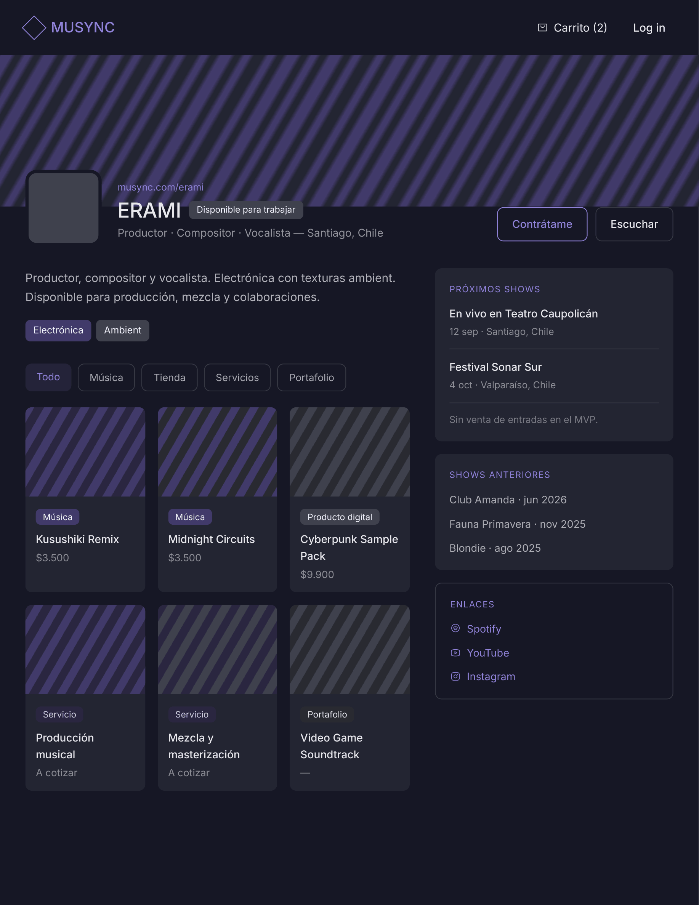
</p>

<br>

## Índice

- [Problema](#problema)
- [Solución](#solución)
- [Usuarios](#usuarios)
- [Funcionalidades del MVP](#funcionalidades-del-mvp)
- [Tipos de publicación](#tipos-de-publicación)
- [Flujo principal de demostración](#flujo-principal-de-demostración)
- [Vistas y navegación](#vistas-y-navegación)
- [Tecnologías](#tecnologías)
- [Arquitectura del proyecto](#arquitectura-del-proyecto)
- [Base de datos](#base-de-datos)
- [API REST](#api-rest)
- [Dirección visual](#dirección-visual)
- [Reglas importantes del MVP](#reglas-importantes-del-mvp)
- [Fuera del alcance](#fuera-del-alcance)
- [Equipo](#equipo)
- [Estado](#estado)

<br>

## Problema

La presencia profesional de un músico suele estar distribuida entre plataformas de streaming, videos, redes sociales, tiendas y formularios de contacto. Esto obliga a compartir muchos enlaces y dificulta mostrar claramente quién es el artista, qué hace y cómo contratarlo.

## Solución

MUSYNC reúne en un perfil público compartible:

- Identidad, biografía y especialidad
- Música, videos y portafolio
- Productos digitales y servicios
- Carrito y órdenes simuladas
- Cotizaciones y solicitudes de contratación
- Próximos shows y trayectoria anterior

> El MVP no busca ser una red social ni un marketplace global. Su centro es la página profesional de cada artista.

## Usuarios

| Rol | Descripción |
|---|---|
| **Artista** | Se registra, inicia sesión, completa su perfil, administra publicaciones y shows, y revisa pedidos y cotizaciones. |
| **Visitante o cliente** | Consulta perfiles y publicaciones, crea una orden de música/productos digitales o envía una solicitud al artista. |

## Funcionalidades del MVP

- Landing Page
- Registro
- Inicio de sesión
- Dashboard privado
- Edición del perfil artístico
- Perfil público compartible
- Sistema unificado de publicaciones
  - Creación de publicaciones
  - Administración CRUD de publicaciones
- Galería o tienda dentro del perfil
- Detalle de publicación
- Carrito básico
- Servicios y cotizaciones
- Contrataciones mediante solicitudes
- Shows próximos y anteriores

## Tipos de publicación

La entidad `publications` reutiliza el mismo flujo para:

| Tipo | Código |
|---|---|
| Música | `music` |
| Producto digital | `digital_product` |
| Servicio | `service` |
| Portafolio | `portfolio` |

Música y productos digitales pueden agregarse al carrito. Los servicios muestran **"Solicitar cotización"**. El portafolio puede mostrarse sin precio.

## Flujo principal de demostración

1. El artista crea una cuenta e inicia sesión.
2. Completa su perfil profesional.
3. Crea un producto digital y un servicio.
4. Visita su perfil público y comprueba que ambas publicaciones aparecen.
5. Un visitante agrega el producto al carrito y finaliza una compra simulada.
6. El backend registra la orden en PostgreSQL.
7. El visitante abre el servicio y envía una cotización.
8. El artista revisa la solicitud desde su dashboard.

<p align="center">

<br><sub>Diagrama de flujo completo: registro, login, dashboard, publicaciones, perfil público, carrito y cotizaciones.</sub>
</p>

<br>

## Vistas y navegación

### Públicas

| Ruta | Vista |
|---|---|
| `/` | Landing Page |
| `/register` | Registro |
| `/login` | Inicio de sesión |
| `/artista/:username` | Perfil público del artista |
| `/publication/:id` | Detalle de publicación |
| `/cart` | Carrito |

<table>
<tr>
<td width="50%" align="center">
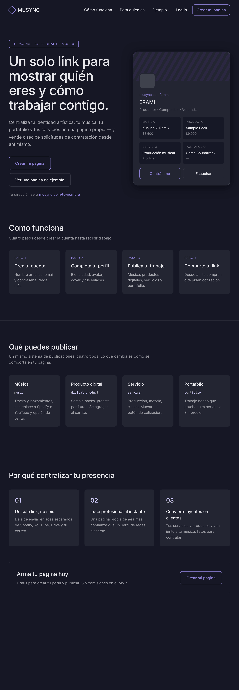<br>
<sub><b>Landing Page</b> — <code>/</code></sub>
</td>
<td width="50%" align="center">
<br>
<sub><b>Perfil público del artista</b> — <code>/artista/:username</code></sub>
</td>
</tr>
<tr>
<td width="50%" align="center">
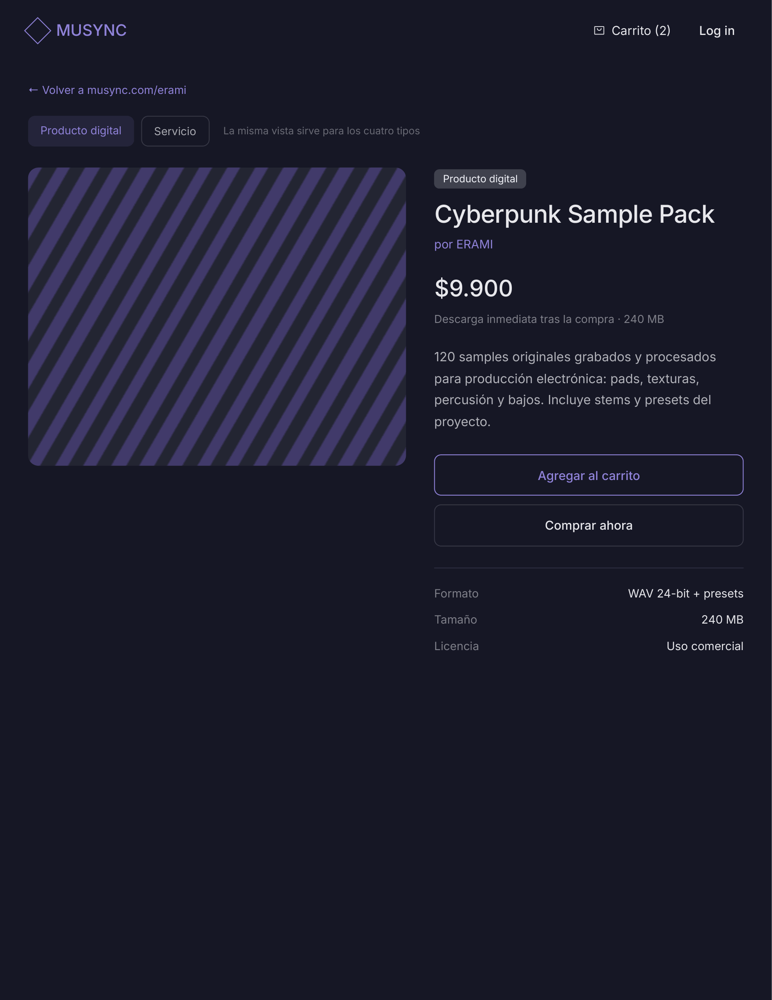<br>
<sub><b>Detalle de publicación</b> — <code>/publication/:id</code></sub>
</td>
<td width="50%" align="center">
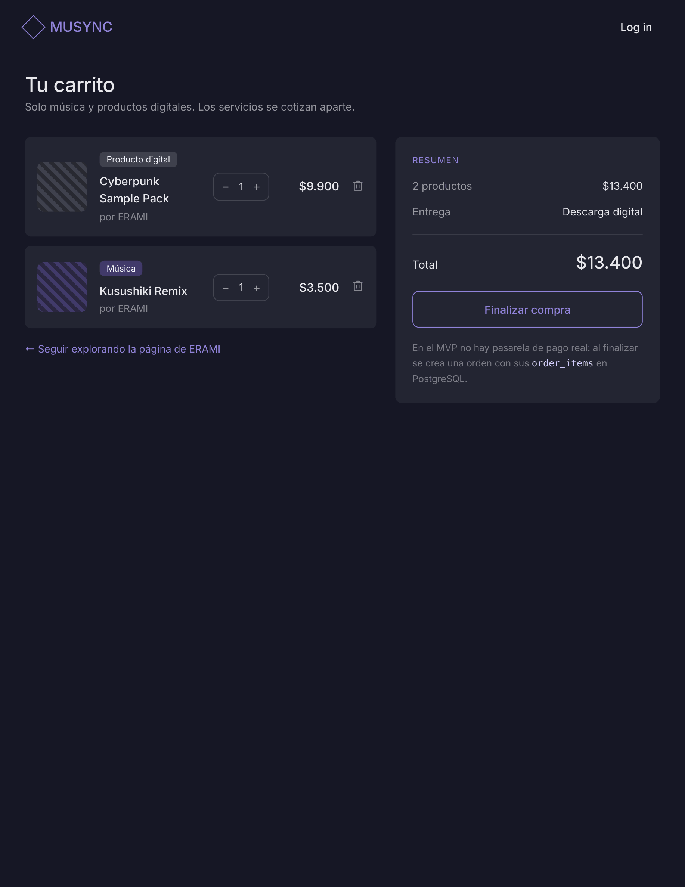<br>
<sub><b>Carrito</b> — <code>/cart</code></sub>
</td>
</tr>
<tr>
<td width="50%" align="center">
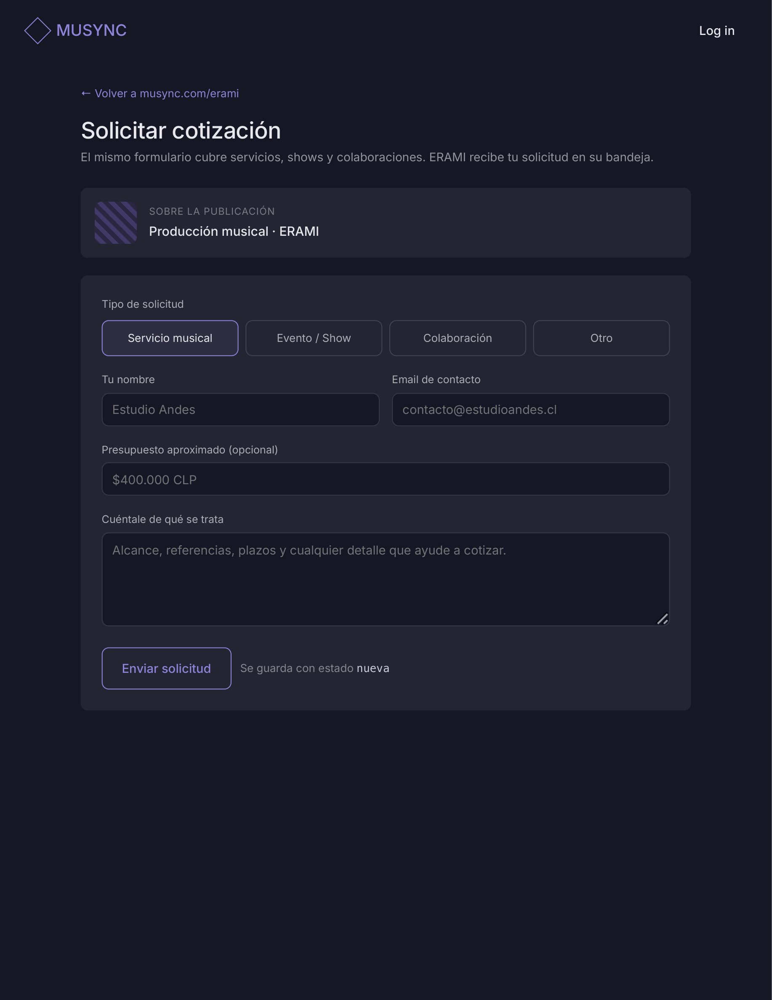<br>
<sub><b>Solicitar cotización</b> — <code>/publication/:id/cotizar</code></sub>
</td>
<td width="50%" align="center"></td>
</tr>
</table>

### Privadas

| Ruta | Vista |
|---|---|
| `/dashboard` | Panel principal |
| `/dashboard/profile` | Editar perfil |
| `/dashboard/publications` | Mis publicaciones |
| `/dashboard/publications/new` | Crear publicación |
| `/dashboard/quotes` | Cotizaciones y solicitudes |
| `/dashboard/orders` | Pedidos |

<table>
<tr>
<td width="50%" align="center">
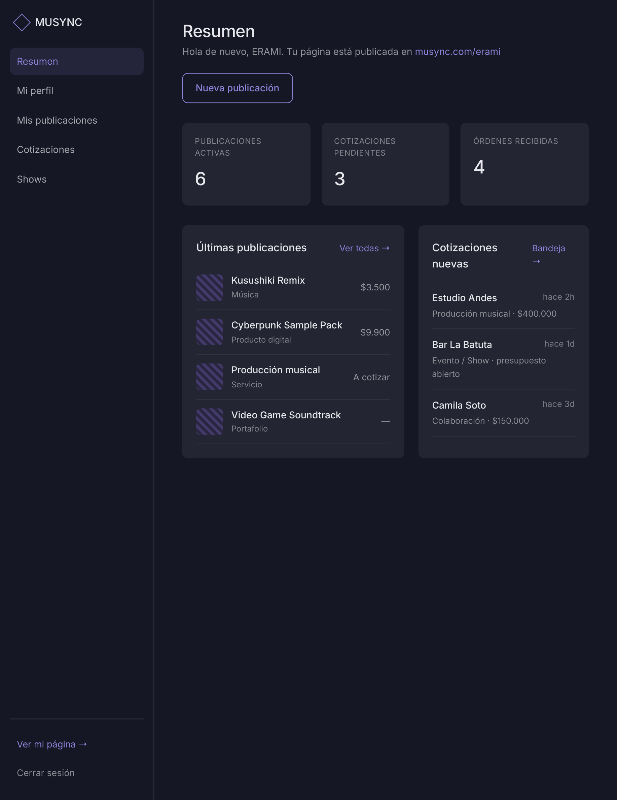<br>
<sub><b>Panel principal</b> — <code>/dashboard</code></sub>
</td>
<td width="50%" align="center">
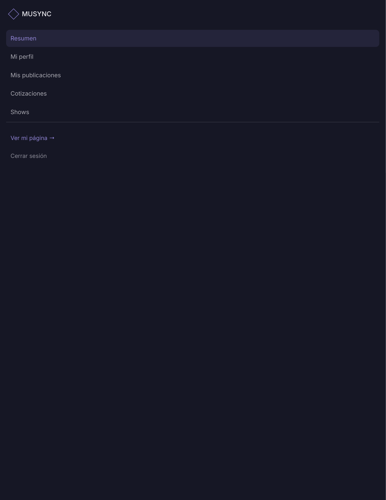<br>
<sub><b>Sidebar de navegación privada</b></sub>
</td>
</tr>
<tr>
<td width="50%" align="center">
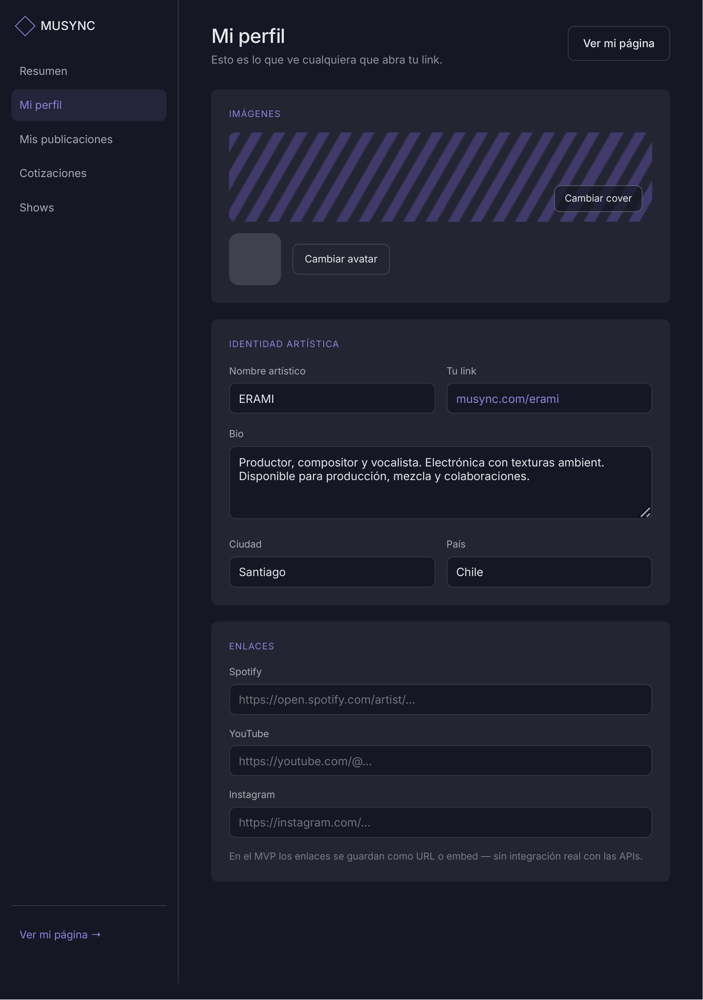<br>
<sub><b>Editar perfil</b> — <code>/dashboard/profile</code></sub>
</td>
<td width="50%" align="center">
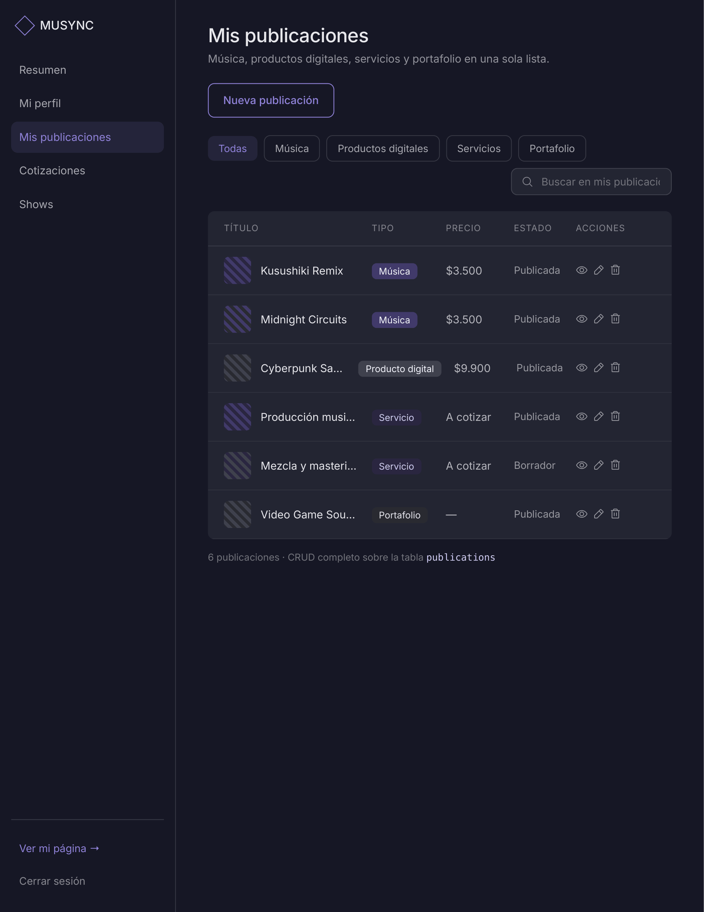<br>
<sub><b>Mis publicaciones</b> — <code>/dashboard/publications</code></sub>
</td>
</tr>
<tr>
<td width="50%" align="center">
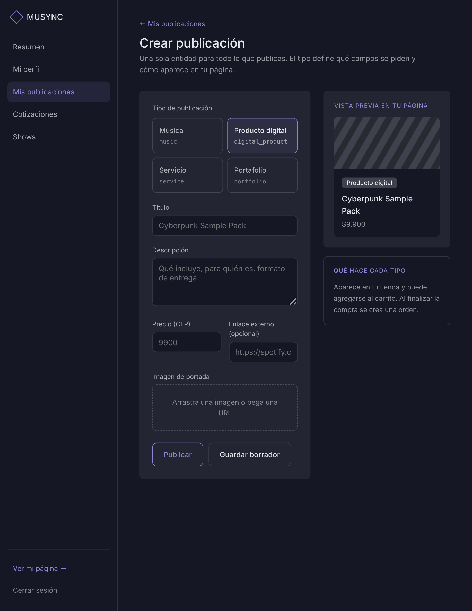<br>
<sub><b>Crear publicación</b> — <code>/dashboard/publications/new</code></sub>
</td>
<td width="50%" align="center">
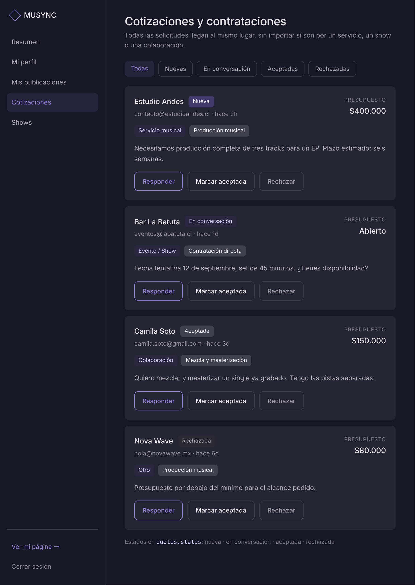<br>
<sub><b>Cotizaciones y contrataciones</b> — <code>/dashboard/quotes</code></sub>
</td>
</tr>
</table>

### Wireframes y flujo de navegación

<p align="center">
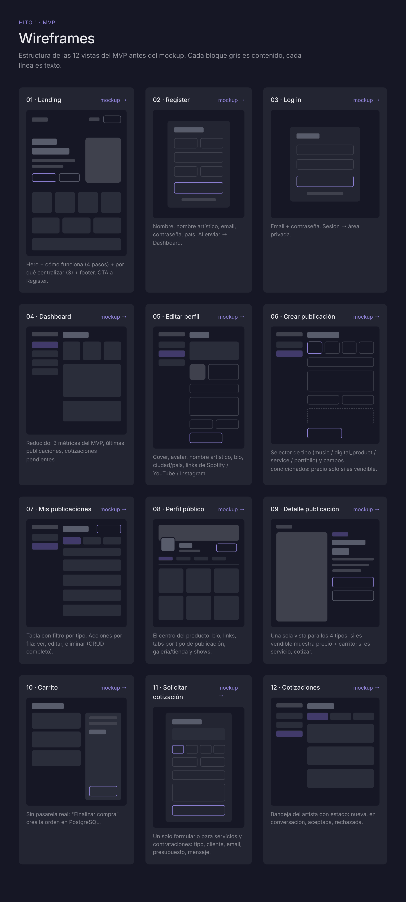
<br><sub>Estructura de las 12 vistas del MVP antes del mockup final.</sub>
</p>

<p align="center">
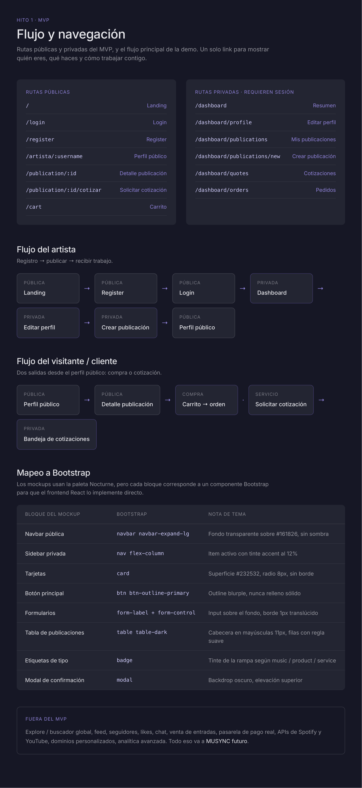
<br><sub>Rutas públicas y privadas, flujo del artista, flujo del visitante y mapeo a componentes Bootstrap.</sub>
</p>

<br>

## Tecnologías

<table>
<tr>
<th>Frontend</th>
<th>Backend</th>
</tr>
<tr>
<td valign="top">

- React
- Vite
- JavaScript
- React Router
- Bootstrap
- ESLint

</td>
<td valign="top">

- Node.js
- Express
- PostgreSQL
- Autenticación mediante token

</td>
</tr>
</table>

## Arquitectura del proyecto

El frontend y el backend se mantienen en repositorios independientes:

- [`JaaviPalta/musync-frontend`](https://github.com/JaaviPalta/musync-frontend)
- [`JaaviPalta/musync-backend`](https://github.com/JaaviPalta/musync-backend)

**Responsabilidades generales:**

| Capa | Responsabilidad |
|---|---|
| **React** | Interfaz, navegación, sesión y carrito temporal |
| **Express** | Rutas, autenticación, validaciones y reglas de negocio |
| **PostgreSQL** | Perfiles, publicaciones, shows, cotizaciones y órdenes |

## Base de datos

El modelo relacional utiliza siete tablas:

| Tabla | Descripción |
|---|---|
| `users` | Cuentas de acceso: nombre, email y contraseña cifrada. |
| `artist_profiles` | Perfil público del artista (bio, especialidad, ciudad, país, avatar, cover y redes) — relación 1:1 con `users`. |
| `publications` | Música, productos digitales, servicios y portafolio publicados por el artista. |
| `shows` | Shows próximos y anteriores programados por el artista. |
| `quotes` | Cotizaciones y solicitudes de contratación recibidas. |
| `orders` | Órdenes simuladas generadas por un visitante o cliente. |
| `order_items` | Publicaciones incluidas en cada orden, con cantidad y precio unitario. |

<p align="center">

<br><sub>Diagrama entidad-relación: <code>users</code>, <code>artist_profiles</code>, <code>publications</code>, <code>shows</code>, <code>quotes</code>, <code>orders</code> y <code>order_items</code>.</sub>
</p>

## API REST

### Convenciones

| Convención | Detalle |
|---|---|
| URL base | `/api` |
| Formato | JSON |
| Autenticación privada | `Authorization: Bearer <token>` |
| Fechas | ISO 8601 |
| Precios | Números en CLP |

**Respuesta exitosa**

```json
{
  "data": {},
  "message": "Operación realizada correctamente"
}
```

**Respuesta de error**

```json
{
  "error": {
    "code": "VALIDATION_ERROR",
    "message": "Los datos enviados no son válidos",
    "details": ["email es obligatorio"]
  }
}
```

### Endpoints

| Método | Ruta | Acceso | Función |
|---|---|---|---|
|  | `/api/auth/register` | Público | Registrar artista. |
|  | `/api/auth/login` | Público | Iniciar sesión. |
|  | `/api/auth/me` | Privado | Obtener sesión actual. |
|  | `/api/artists/:username` | Público | Obtener perfil público completo. |
|  | `/api/profile` | Privado | Obtener perfil propio. |
|  | `/api/profile` | Privado | Crear o actualizar perfil propio. |
|  | `/api/publications/:id` | Público | Ver detalle de publicación activa. |
|  | `/api/artists/:username/publications` | Público | Listar publicaciones del artista. |
|  | `/api/publications` | Privado | Listar publicaciones propias. |
|  | `/api/publications` | Privado | Crear publicación. |
|  | `/api/publications/:id` | Privado | Editar publicación propia. |
|  | `/api/publications/:id` | Privado | Eliminar o desactivar publicación propia. |
|  | `/api/artists/:username/shows` | Público | Listar shows del artista. |
|  | `/api/shows` | Privado | Listar shows propios. |
|  | `/api/shows` | Privado | Crear show. |
|  | `/api/shows/:id` | Privado | Editar show propio. |
|  | `/api/shows/:id` | Privado | Eliminar show propio. |
|  | `/api/quotes` | Público | Enviar cotización o contratación. |
|  | `/api/quotes` | Privado | Listar solicitudes recibidas. |
|  | `/api/quotes/:id/status` | Privado | Cambiar estado de una solicitud. |
|  | `/api/orders` | Público | Crear orden simulada. |
|  | `/api/orders` | Privado | Listar pedidos recibidos por el artista. |
|  | `/api/orders/:id` | Privado | Ver detalle de un pedido relacionado. |

### 1. Autenticación

 `/api/auth/register`

```json
{
  "name": "string",
  "artist_name": "string",
  "username": "string",
  "email": "string",
  "password": "string"
}
```

Respuesta `201 Created`:

```json
{
  "data": {
    "user": { "id": 1, "name": "Javiera", "email": "erami@example.com" },
    "profile": { "id": 1, "artist_name": "Erami", "username": "erami" },
    "token": "jwt"
  }
}
```

 `/api/auth/login`

```json
{
  "email": "string",
  "password": "string"
}
```

Respuesta `200 OK`: usuario, perfil y token. La contraseña nunca aparece en la respuesta.

### 2. Perfil de artista

 `/api/artists/:username`

Respuesta `200 OK`:

```json
{
  "data": {
    "id": 1,
    "username": "erami",
    "artist_name": "Erami",
    "bio": "Productora y compositora",
    "specialty": "Producción musical",
    "city": "Santiago",
    "country": "Chile",
    "avatar_url": "https://example.com/avatar.jpg",
    "cover_url": "https://example.com/cover.jpg",
    "social_links": {
      "spotify": "https://spotify.com/...",
      "youtube": "https://youtube.com/...",
      "instagram": "https://instagram.com/...",
      "tiktok": null
    }
  }
}
```

 `/api/profile`

Acepta los campos editables del perfil. El usuario solo puede modificar su propio perfil.

### 3. Publicaciones

 `/api/publications`

```json
{
  "type": "string",
  "title": "string",
  "description": "string",
  "price": "number",
  "image_url": "string",
  "external_url": null
}
```

Respuesta `201 Created`: publicación creada.

**Reglas:**

- `type`: `music`, `digital_product`, `service` o `portfolio`.
- `music` y `digital_product` requieren precio para venderse.
- `portfolio` puede tener precio `null`.
- El servidor obtiene `artist_id` desde el token.

 `/api/artists/:username/publications?type=music`

El filtro `type` es opcional. Devuelve solo publicaciones activas.

 `/api/publications/:id` y  `/api/publications/:id`

Solo el artista propietario puede editar o eliminar. La eliminación puede implementarse como desactivación con `is_active = false` para conservar referencias históricas.

### 4. Shows

 `/api/shows`

```json
{
  "name": "string",
  "venue": "string",
  "city": "string",
  "show_date": "string"
}
```

 `/api/artists/:username/shows?period=upcoming` acepta `upcoming`, `past` o, sin filtro, todos.

### 5. Cotizaciones y contrataciones

 `/api/quotes`

```json
{
  "artist_id": "number",
  "publication_id": "number",
  "request_type": "string",
  "client_name": "string",
  "client_email": "string",
  "budget": "number",
  "event_date": null,
  "message": "string"
}
```

`publication_id` es opcional para solicitudes iniciadas desde el perfil. Respuesta `201 Created` con estado inicial `pending`.

 `/api/quotes/:id/status`

```json
{ "status": "string" }
```

Estados válidos: `pending`, `reviewed`, `accepted`, `rejected`.

### 6. Órdenes simuladas

El carrito vive temporalmente en el frontend. Al finalizar, se envían sus ítems al backend.

 `/api/orders`

```json
{
  "buyer_name": "string",
  "buyer_email": "string",
  "items": [
    { "publication_id": "number", "quantity": "number" }
  ]
}
```

Respuesta `201 Created`:

```json
{
  "data": {
    "id": 25,
    "status": "created",
    "total": 10980,
    "items": [
      { "publication_id": 3, "title": "Kusushiki Remix", "quantity": 1, "unit_price": 1990 },
      { "publication_id": 5, "title": "Cyberpunk Sample Pack", "quantity": 1, "unit_price": 8990 }
    ],
    "created_at": "2026-08-11T23:00:00Z"
  },
  "message": "Orden registrada. No se realizó un pago real."
}
```

El servidor debe comprobar que las publicaciones estén activas y sean `music` o `digital_product`, consultar sus precios y calcular el total.

### Códigos HTTP

| Código | Uso |
|---|---|
| `200` | Consulta o actualización correcta. |
| `201` | Recurso creado. |
| `204` | Eliminación correcta sin cuerpo. |
| `400` | Datos inválidos o regla de negocio incumplida. |
| `401` | Token ausente o inválido. |
| `403` | Usuario autenticado sin permiso sobre el recurso. |
| `404` | Recurso inexistente. |
| `409` | Email o username duplicado. |
| `500` | Error interno no esperado. |

### Alcance excluido

Esta API no incluye pagos reales, entrega protegida de archivos, seguidores, likes, comentarios, chat, venta de entradas, analytics ni integraciones directas con Spotify o YouTube.

## Dirección visual

<table>
<tr>
<td width="15%"><br><sub>Fondo principal</sub></td>
<td width="15%"><br><sub>Texto</sub></td>
<td width="15%"><br><sub>Acento</sub></td>
</tr>
</table>

| Propiedad | Valor |
|---|---|
| Tipografía | Inter |
| Radios | 8 px |
| Botones | Principalmente *outline* |
| Iconografía | Phosphor |

La estética busca ser oscura, limpia, moderna y musical. El concepto anterior de *Claude Design* se utiliza como referencia visual, adaptado al alcance real del MVP.

## Reglas importantes del MVP

- No existe pago real: finalizar el carrito crea una orden en PostgreSQL.
- El carrito puede almacenarse temporalmente en el frontend.
- Spotify y YouTube se incorporan mediante enlaces o embeds simples.
- Las contrataciones reutilizan el sistema de cotizaciones.
- Los shows no incluyen venta de entradas.
- Solo el propietario puede modificar sus recursos privados.
- Las contraseñas deben guardarse cifradas.

## Fuera del alcance

- Seguidores, feed, likes y comentarios
- Chat o mensajería interna
- Analytics, reviews, favoritos y notificaciones
- Marketplace global y buscador avanzado
- Pagos reales y descargas protegidas
- Venta de entradas
- Integraciones directas con Spotify o YouTube
- Calendario avanzado, contratos automáticos y dominios personalizados

> Estas funciones pertenecen a una posible evolución futura y no deben interferir con la entrega del MVP en aproximadamente un mes.

## Equipo

| Integrante | Área principal |
|---|---|
| Javiera | Frontend |
| Milton | Backend |
| Germán | Backend |

## Estado

**Hito 1 — Diseño y prototipo**

Entregables definidos:

- [x] Alcance del MVP
- [x] Diagrama de flujo
- [x] Navegación pública y privada
- [x] Tecnologías y dependencias
- [x] Modelo relacional
- [x] Contrato de API REST
- [x] README de presentación

<br>

<div align="center">

**MUSYNC** — Un solo link para mostrar quién eres como artista, qué haces y cómo trabajar contigo.

</div>
